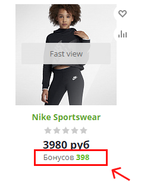

# Компонент mindbox:product.bonus

## Описание mindbox:product.bonus

Одностраничный компонент, который реализует получение и отображение бонусов, которые получит покупатель при покупки данного товара. Расчет значения начисляемых бонусов осуществляется на стороне сервиса Mindbox.

[Параметры](https://www.notion.so/7dafa52b7d574cda8206ffff2df93abd)

### Особенности работы

Для нормальной работы компонента необходимо в настройках модуля включить обработчик `OnEndBufferContent.`

### Пример вызова

```php
$APPLICATION->IncludeComponent(
    'mindbox:product.bonus',
    '',
    [
        'ID' => $item['ID'],
        'PRICE' => $item['MIN_PRICE']['VALUE'],
        'LABEL' => 'Бонусов'
    ]
);
```

### Результат вызова



### Кастомизация отображения

Для того чтобы изменить отображение компонента в публичной необходимо скопировать стандартный шаблон компонента, и уже в рамках этого шаблона изменять стили.

При изменении кода в файле `template.php` необходимо оставить неизменными классы с префиксом `mindbox-` , это гарантирует безошибочную работу компонента.

### Интеграция компонента в случае использования торговых предложений

Если товары в вашем каталоге имеют торговые предложения и на публичной части реализован функционал переключения карточек товара по средствам js, то для корректной работы компонента необходимо доработать клиентский код js.

Необходимо в код, который отвечает за переключение торгового предложения встроить следующий код.

```jsx
let mindboxBonusBlock = document.querySelector('.mindbox-product-bonus');
mindboxBonusBlock.dispatchEvent(new CustomEvent("changeProductBonus", {
	detail: { 
		productId: 789, // id торгового предложения
		price: 1000 // цена торгового предложения
	}
}));
```

Пример интеграции со стандартным компонентом catalog.section

```jsx
let th = $(this.obProduct).closest('.catalog_item_wrapp');
let bonusBlock = th.find('.mindbox-product-bonus')[0];

bonusBlock.dispatchEvent(new CustomEvent("changeProductBonus", {
			detail: { 
				productId: obj['ID'], 
				price: obj['PRICE']['DISCOUNT_VALUE'] 
			}
}));
```