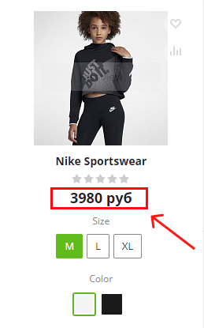

# Компонент mindbox:product.price

## Описание mindbox:product.price

Одностраничный компонент, который реализует получение и отображение цен товара из сервиса Mindbox.

## Параметры

| Поле                 | Параметр | Описание                                                                |
|----------------------|----------|-------------------------------------------------------------------------|
| Идентификатор товара | ID       | ID товара или торгового предложения                                     |
| Цена товара          | PRICE    | Цена товара или торгового предложения                                   |
| Валюта               | CURRENCY | Указывается строковое значение валюты для отображения в публичной части |

## Особенности работы

Для корректной работы компонента необходимо в настройках модуля включить обработчик `OnEndBufferContent`

## Пример вызова

```php
$APPLICATION->IncludeComponent(
    'mindbox:product.price',
    '',
    [
        'ID' => $item['ID'],
        'PRICE' => $item['MIN_PRICE']['VALUE'],
        'CURRENCY' => 'руб'
    ]
);
```

## Результат вызова



## Кастомизация отображения

Для того чтобы изменить отображение компонента в публичной части, необходимо скопировать стандартный шаблон компонента, и уже в рамках этого шаблона изменять стили.

При изменении кода в файле `template.php` необходимо оставить неизменными классы с префиксом `mindbox-` , это гарантирует безошибочную работу компонента.

## Интеграция компонента в случае использования торговых предложений

Если товары в вашем каталоге имеют торговые предложения и в публичной части реализован функционал переключения карточек товара с помощью js, то для корректной работы компонента необходимо доработать клиентский код js.

Необходимо в код, который отвечает за переключение торгового предложения, встроить следующий код:

```jsx
let mindboxPriceBlock = document.querySelector('.mindbox-product-price');
mindboxPriceBlock.dispatchEvent(new CustomEvent("changeProductPrice", {
	detail: { 
		productId: 789, // id торгового предложения
		price: 1000 // цена торгового предложения
	}
}));
```

Пример интеграции со стандартным компонентом catalog.section:

```jsx
let th = $(this.obProduct).closest('.catalog_item_wrapp');
let mindboxPriceBlock = th.find('.mindbox-product-price')[0];

mindboxPriceBlock.dispatchEvent(new CustomEvent("changeProductPrice", {
	detail: { 
		productId: obj['ID'], 
		price: obj['PRICE']['DISCOUNT_VALUE'] 
	}
}));
```
